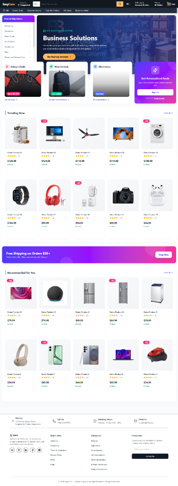

<div align="center">

# 🚀 EasyCom — Next-Gen E-Commerce Platform

[](https://nextjs.org/)
[](https://react.dev/)
[](https://www.typescriptlang.org/)
[](https://www.sanity.io/)
[](https://tailwindcss.com/)

**A modern, feature-rich e-commerce platform built with cutting-edge technologies.**

*🔄 Actively under development — Contributions welcome!*

[Live Demo](#) · [Report Bug](https://github.com/sajidmahamud835/easycom/issues) · [Request Feature](https://github.com/sajidmahamud835/easycom/issues)

</div>

---



## 🌟 About The Project

**EasyCom** is an innovative, full-stack e-commerce platform designed to bridge the gap between B2C and B2B commerce. Built as a capstone project, it showcases modern web development practices and aims to evolve into a production-ready marketplace solution.

### 🎯 Vision

To create a unified commerce platform that seamlessly handles both consumer shopping and wholesale business operations, powered by AI-driven recommendations and real-time inventory management.

---

## ✨ Features

### 🟢 Implemented Features

| Category | Features |
|----------|----------|
| **🛍️ Shopping** | Product catalog, categories, brands, advanced search & filters |
| **🛒 Cart & Checkout** | Persistent shopping cart, real-time updates, multi-step checkout |
| **💝 Wishlist** | Save favorites, move to cart functionality |
| **👤 Authentication** | Secure auth via Clerk, social logins, protected routes |
| **📦 Orders** | Order tracking, history, status updates, email notifications |
| **💳 Payments** | Stripe integration, Cash on Delivery support |
| **📱 Responsive** | Mobile-first design, works on all devices |
| **🎨 Modern UI** | Tailwind CSS, Framer Motion animations, shadcn/ui components |
| **⭐ Reviews** | Customer ratings, product reviews |
| **📧 Notifications** | Email confirmations via Nodemailer |

### 🟡 In Progress

- 🤖 **AI-Powered Recommendations** — Personalized product suggestions
- 📊 **Analytics Dashboard** — Comprehensive business insights
- 👥 **Multi-tenant Support** — Vendor/seller accounts

### 🔵 Planned Features

- 📝 Review moderation tools
- 📬 Newsletter & email campaigns
- 📈 Advanced customer insights
- 📥 Data export (Excel/CSV)
- 🎨 Custom admin branding
- 🌐 Multi-language support
- 🔔 Push notifications

---

## 🚀 Quick Start

### Prerequisites

- **Node.js** 18.0+ ([Download](https://nodejs.org/))
- **npm**, **yarn**, or **pnpm**
- **Git** ([Download](https://git-scm.com/))

### Installation

1. **Clone the repository**
   ```bash
   git clone https://github.com/sajidmahamud835/easycom.git
   cd easycom
   ```

2. **Install dependencies**
   ```bash
   npm install
   # or
   pnpm install
   ```

3. **Configure environment variables**
   
   Copy the example environment file:
   ```bash
   cp .env.example .env
   ```
   
   Fill in your credentials (see [Environment Variables](#environment-variables) section below).

4. **Start the development server**
   ```bash
   npm run dev
   ```

5. **Open your browser**
   - Frontend: [http://localhost:3000](http://localhost:3000)
   - Admin Panel: [http://localhost:3000/admin](http://localhost:3000/admin)
   - Sanity Studio: [http://localhost:3000/studio](http://localhost:3000/studio)

---

## 🔐 Environment Variables

Create a `.env` file with the following variables:

```bash
# Base URL
NEXT_PUBLIC_BASE_URL=http://localhost:3000

# Sanity CMS
NEXT_PUBLIC_SANITY_PROJECT_ID=your_project_id
NEXT_PUBLIC_SANITY_DATASET=production
NEXT_PUBLIC_SANITY_API_VERSION=2024-11-09
SANITY_API_TOKEN=your_token

# Clerk Authentication
NEXT_PUBLIC_CLERK_PUBLISHABLE_KEY=your_key
CLERK_SECRET_KEY=your_secret

# Stripe Payments
NEXT_PUBLIC_STRIPE_PUBLISHABLE_KEY=your_key
STRIPE_SECRET_KEY=your_secret
STRIPE_WEBHOOK_SECRET=your_webhook_secret

# Email (Nodemailer)
EMAIL_USER=your_email
EMAIL_PASSWORD=your_app_password

# Admin Email
NEXT_PUBLIC_ADMIN_EMAIL=admin@example.com
```

> 💡 See `.env.example` for the complete list of available variables.

---

## 📁 Project Structure

```
easycom/
├── app/                    # Next.js App Router
│   ├── (admin)/           # Admin dashboard routes
│   ├── (auth)/            # Authentication pages
│   ├── (client)/          # Customer-facing routes
│   ├── (public)/          # Public pages
│   └── (user)/            # Protected user routes
├── components/            # React components
├── actions/              # Server actions
├── lib/                  # Utilities & helpers
├── sanity/               # Sanity CMS config
├── types/                # TypeScript definitions
├── hooks/                # Custom React hooks
└── public/               # Static assets
```

---

## 🤝 Contributing

We welcome contributions from developers of all skill levels! Here's how you can help:

### Ways to Contribute

| Type | Description |
|------|-------------|
| 🐛 **Bug Reports** | Found a bug? Open an issue with details |
| 💡 **Feature Ideas** | Suggest new features or improvements |
| 🔧 **Code Contributions** | Submit PRs for bug fixes or features |
| 📝 **Documentation** | Improve docs, add examples, fix typos |
| 🎨 **UI/UX** | Design improvements and accessibility |
| 🧪 **Testing** | Add tests, report edge cases |

### Getting Started

1. **Fork the repository**
   
   Click the "Fork" button at [https://github.com/sajidmahamud835/easycom](https://github.com/sajidmahamud835/easycom)

2. **Clone your fork**
   ```bash
   git clone https://github.com/YOUR_USERNAME/easycom.git
   cd easycom
   ```

3. **Create a feature branch**
   ```bash
   git checkout -b feature/amazing-feature
   ```

4. **Make your changes**
   - Follow the existing code style
   - Write meaningful commit messages
   - Add tests if applicable

5. **Push and create a Pull Request**
   ```bash
   git push origin feature/amazing-feature
   ```
   Then open a PR on GitHub!

### Development Guidelines

- ✅ Use TypeScript for type safety
- ✅ Follow the existing project structure
- ✅ Keep components small and focused
- ✅ Write descriptive commit messages
- ✅ Test your changes before submitting
- ✅ Update documentation as needed

### Good First Issues

Look for issues labeled `good first issue` — these are great for newcomers!

---

## 🛠️ Tech Stack

| Category | Technologies |
|----------|-------------|
| **Frontend** | Next.js 15, React 19, TypeScript |
| **Styling** | Tailwind CSS, shadcn/ui, Framer Motion |
| **Backend** | Next.js API Routes, Server Actions |
| **Database/CMS** | Sanity.io |
| **Authentication** | Clerk |
| **Payments** | Stripe |
| **Email** | Nodemailer |
| **Deployment** | Vercel |

---

## 📜 Scripts

```bash
npm run dev       # Start development server
npm run build     # Build for production
npm start         # Start production server
npm run lint      # Run ESLint
npm run typegen   # Generate Sanity types
```

---

## 📄 License

This project is open for educational purposes. See the repository for more details.

---

## 👨‍💻 Author

**Sajid Mahamud**

- GitHub: [@sajidmahamud835](https://github.com/sajidmahamud835)

---

## 🙏 Acknowledgments

Built with amazing open-source tools:

- [Next.js](https://nextjs.org/) — React framework
- [Sanity](https://www.sanity.io/) — Headless CMS
- [Clerk](https://clerk.com/) — Authentication
- [Stripe](https://stripe.com/) — Payments
- [Tailwind CSS](https://tailwindcss.com/) — Styling
- [shadcn/ui](https://ui.shadcn.com/) — UI components
- [Framer Motion](https://www.framer.com/motion/) — Animations

---

<div align="center">

**⭐ Star this repo if you find it helpful!**

*Made with ❤️ by [Sajid Mahamud](https://github.com/sajidmahamud835)*

</div>
